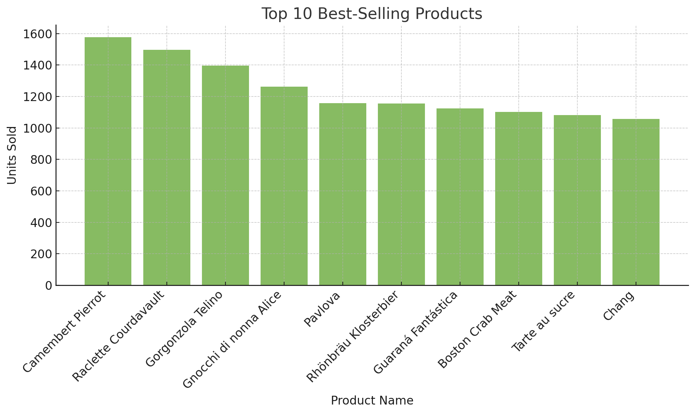
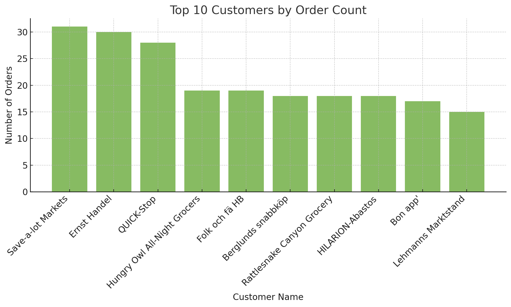
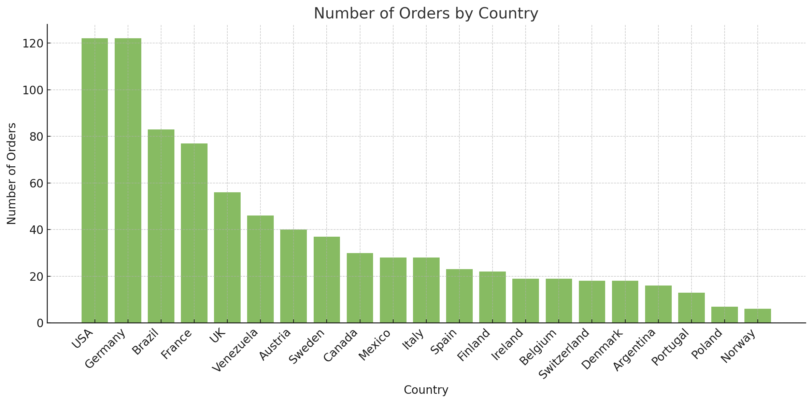
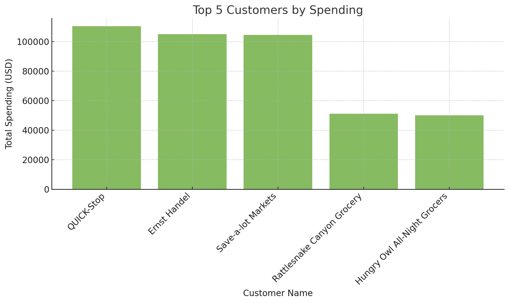
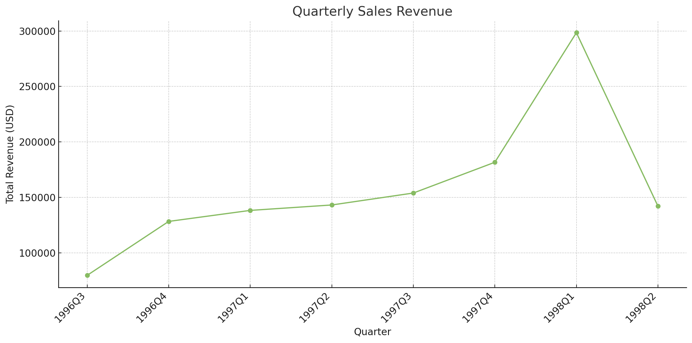
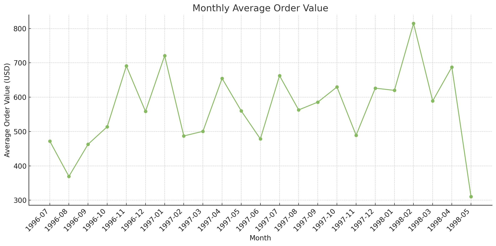
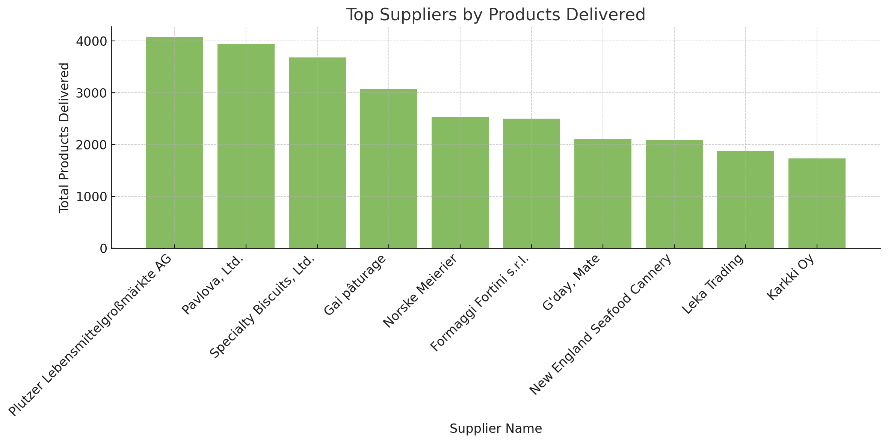

# Northwind Database Analysis

## Summary 📄🌟

This project focuses on analyzing the Northwind database to extract valuable business insights through SQL queries and visualizations. The analysis covers various aspects, such as top-performing products, customer behavior, employee tenure, and regional order patterns. The visualizations, generated using ChatGPT, make complex data easier to understand. Key takeaways include identifying major revenue sources, understanding customer trends, and highlighting operational efficiency opportunities.

## Overview 🌐🎨🌍

This project analyzes the Northwind database to uncover valuable insights about sales, customers, products, and suppliers. The findings are based on SQL queries executed on the database, with accompanying visualizations to enhance comprehension.

## Objectives 🔄🏢📊

1. Identify the top-selling products by units sold.
2. Determine the number of orders placed by each customer.
3. Find employees with the longest tenure at the company.
4. Analyze the number of orders placed by customers from various countries.
5. Explore advanced metrics such as top customers by spending, quarterly sales, and supplier performance.

---

## Basic Level Tasks 📊📚🛠

### 1. Top-Selling Products 🍎💸🛒

**Task:**
Find the top 10 best-selling products in the company's history (in terms of units sold). For each product, provide the name, category, and total units sold.

**Query:**

```sql
SELECT p.product_id, p.product_name, SUM(od.quantity) AS total_quantity
FROM order_details AS od
INNER JOIN products AS p
USING (product_id)
GROUP BY p.product_id, p.product_name
ORDER BY total_quantity DESC
LIMIT 10;
```

**Results:**

| Product ID | Product Name           | Total Quantity |
| ---------- | ---------------------- | -------------- |
| 60         | Camembert Pierrot      | 1577           |
| 59         | Raclette Courdavault   | 1496           |
| 31         | Gorgonzola Telino      | 1397           |
| 56         | Gnocchi di nonna Alice | 1263           |
| 16         | Pavlova                | 1158           |
| 75         | Rhönbräu Klosterbier   | 1155           |
| 24         | Guaraná Fantástica     | 1125           |
| 40         | Boston Crab Meat       | 1103           |
| 62         | Tarte au sucre         | 1083           |
| 2          | Chang                  | 1057           |


*Bar graph visualizing the top 10 best-selling products by units sold; ChatGPT generated this graph from SQL query results.*

### 2. Order Count by Customer 📑💳🌍

**Task:**
Calculate the number of orders placed by each customer. Provide the customer's name, their ID, and the total number of orders.

**Query:**

```sql
SELECT customer_id, company_name, COUNT(order_id) AS order_count
FROM orders
INNER JOIN customers
USING (customer_id)
GROUP BY customer_id, company_name
ORDER BY order_count DESC;
```

**Results:**

| Customer ID | Company Name                 | Order Count |
| ----------- | ---------------------------- | ----------- |
| SAVEA       | Save-a-lot Markets           | 31          |
| ERNSH       | Ernst Handel                 | 30          |
| QUICK       | QUICK-Stop                   | 28          |
| HUNGO       | Hungry Owl All-Night Grocers | 19          |
| FOLKO       | Folk och fä HB               | 19          |


*Bar graph showing the number of orders by the top 10 customers; ChatGPT generated this graph from SQL query results.*

### 3. Employees with the Longest Tenure 👷🏻‍♂️🕰

**Task:**
Find employees with the longest tenure at the company. Calculate the length of service for each employee based on their hire date and the current date.

**Query:**

```sql
SELECT CONCAT(last_name, ' ', first_name) AS employee, CONCAT(DATE_PART('year', AGE(NOW(), hire_date)), ' years and ', DATE_PART('month', AGE(NOW(), hire_date)), ' months') AS tenure
FROM employees
ORDER BY NOW()::date - hire_date DESC;
```

**Results:**

| Employee Name    | Tenure                |
| ---------------- | --------------------- |
| Leverling Janet  | 32 years and 9 months |
| Davolio Nancy    | 32 years and 8 months |
| Fuller Andrew    | 32 years and 5 months |
| Peacock Margaret | 31 years and 8 months |
| Buchanan Steven  | 31 years and 2 months |

### 4. Orders by Country 🇺🇳📑

**Task:**
Display the number of orders placed by customers from each country.

**Query:**

```sql
SELECT country, COUNT(order_id) AS order_count
FROM orders
INNER JOIN customers
USING (customer_id)
GROUP BY country
ORDER BY order_count DESC;
```

**Results:**

| Country | Order Count |
| ------- | ----------- |
| Germany | 122         |
| USA     | 122         |
| Brazil  | 83          |
| France  | 77          |
| UK      | 56          |


*Bar graph displaying the number of orders by country; ChatGPT generated this graph from SQL query results.*

---

## Intermediate Level Tasks 🔧📚🌟

### 1. Top Customers by Spending 💸💰🌍

**Task:**
Find the top 5 customers who spent the most money on orders. Provide the customer's name, country, and total amount spent.

**Query:**

```sql
SELECT customer_id, company_name, country, ROUND(SUM(unit_price * (1 - discount) * quantity)) AS total_price
FROM order_details
INNER JOIN orders
USING (order_id)
INNER JOIN customers
USING (customer_id)
GROUP BY customer_id, company_name, country
ORDER BY total_price DESC
LIMIT 5;
```

**Results:**

| Customer ID | Company Name                 | Country | Total Spending (USD) |
| ----------- | ---------------------------- | ------- | -------------------- |
| QUICK       | QUICK-Stop                   | Germany | 110277               |
| ERNSH       | Ernst Handel                 | Austria | 104875               |
| SAVEA       | Save-a-lot Markets           | USA     | 104362               |
| RATTC       | Rattlesnake Canyon Grocery   | USA     | 51098                |
| HUNGO       | Hungry Owl All-Night Grocers | Ireland | 49980                |


*Bar graph showing the top 5 customers by total spending; ChatGPT generated this graph from SQL query results.*

### 2. Quarterly Sales Revenue 🔄🎨💳

**Task:**
Calculate the total sales revenue for each quarter of every year. Order the results by year and quarter.

**Query:**

```sql
SELECT EXTRACT('year' FROM order_date) AS year, EXTRACT('quarter' FROM order_date) AS quarter, ROUND(SUM(unit_price * (1 - discount) * quantity)) AS total_price
FROM order_details
INNER JOIN orders
USING (order_id)
GROUP BY year, quarter
ORDER BY year, quarter;
```

**Results:**

| Year | Quarter | Total Revenue (USD) |
| ---- | ------- | ------------------- |
| 1996 | 3       | 79729               |
| 1996 | 4       | 128355              |
| 1997 | 1       | 138289              |
| 1997 | 2       | 143177              |
| 1997 | 3       | 153938              |


*Line chart depicting quarterly sales revenue over time; ChatGPT generated this graph from SQL query results.*

### 3. Average Order Value 📊💵📆

**Task:**
Calculate the average order value for each month over the last two years. Provide the year, month, and average order value.

**Query:**

```sql
SELECT EXTRACT('year' FROM order_date) AS year, EXTRACT('month' FROM order_date) AS month, AVG(unit_price * (1 - discount) * quantity) AS avg_price
FROM order_details
INNER JOIN orders
USING (order_id)
GROUP BY year, month
ORDER BY year, month;
```

**Results:**

| Year | Month | Average Order Value (USD) |
| ---- | ----- | ------------------------- |
| 1996 | 7     | 472.23                    |
| 1996 | 8     | 369.35                    |
| 1996 | 9     | 462.83                    |
| 1996 | 10    | 513.91                    |
| 1996 | 11    | 690.91                    |


*Line chart showing the average order value by month; ChatGPT generated this graph from SQL query results.*

### 4. Top Suppliers by Products Delivered 🚛📦

**Task:**
Identify the suppliers who delivered the largest number of products. Provide the supplier's name and the total number of products delivered.

**Query:**

```sql
SELECT supplier_id, company_name, SUM(quantity) AS total_products_delivered
FROM order_details
INNER JOIN products
USING (product_id)
INNER JOIN suppliers
USING(supplier_id)
GROUP BY  supplier_id, company_name
ORDER BY total_products_delivered DESC;
```

**Results:**

| Supplier ID | Supplier Name                     | Total Products Delivered |
| ----------- | --------------------------------- | ------------------------ |
| 12          | Plutzer Lebensmittelgroßmärkte AG | 4072                     |
| 7           | Pavlova, Ltd.                     | 3937                     |
| 8           | Specialty Biscuits, Ltd.          | 3679                     |
| 28          | Gai pâturage                      | 3073                     |
| 15          | Norske Meierier                   | 2526                     |


*Bar graph highlighting the top suppliers by total products delivered; ChatGPT generated this graph from SQL query results.*

---

## What I Learned 📚✍️🌟

Working on this project helped me develop a deeper understanding of the following skills and tools:

1. **SQL Proficiency:**

   - Learned to use `JOIN` statements effectively for combining data from multiple tables.
   - Mastered aggregate functions such as `SUM`, `AVG`, and `COUNT` to extract meaningful insights.
   - Gained experience with grouping and ordering data using `GROUP BY` and `ORDER BY` clauses.
   - Practiced working with date and time functions for tasks such as calculating employee tenure and analyzing sales trends.

2. **Data Visualization:**

   - Created visualizations such as bar charts and line graphs to present query results effectively.
   - Understood the importance of visual aids in communicating findings clearly and concisely.

3. **Data Analysis Workflow:**

   - Developed a structured approach to problem-solving by breaking down tasks into smaller, manageable steps.
   - Learned how to interpret raw data and convert it into actionable insights.

4. **Collaboration with Tools:**

   - Leveraged ChatGPT to generate SQL queries and visualizations, streamlining the analysis process.
   - Gained insights into the value of AI tools in enhancing productivity and accuracy in data projects.

---

## Conclusions 💡🌍🕵️

- **Product Performance:** 🛒 "Camembert Pierrot" is the best-selling product, followed closely by "Raclette Courdavault."
- **Customer Insights:** 📑 "Save-a-lot Markets" leads in order volume, reflecting strong engagement.
- **Employee Tenure:** 👷🏻‍♂️ Janet Leverling stands out as the longest-serving employee, exemplifying commitment.
- **Country Analysis:** 🌍 Germany and the USA are the top contributors to order volume, emphasizing their importance as key markets.

These findings provide a foundation for strategic decisions aimed at strengthening relationships with top customers, optimizing product offerings, and focusing on high-performing regions.

