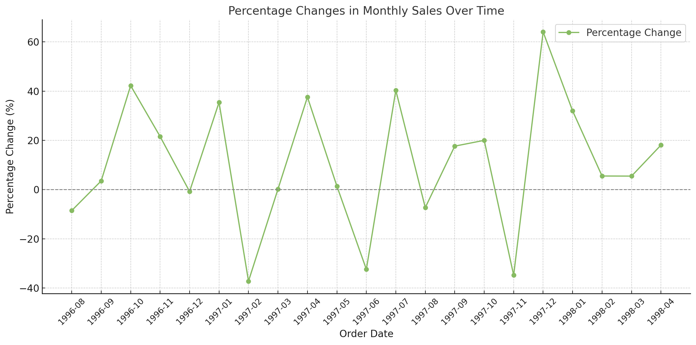

# Northwind Database Analysis

## Summary 📄🌟

This project focuses on analyzing the Northwind database to extract valuable business insights through SQL queries and visualizations. The analysis covers various aspects, such as top-performing products, customer behavior, employee tenure, and regional order patterns. The visualizations, generated using ChatGPT, make complex data easier to understand. Key takeaways include identifying major revenue sources, understanding customer trends, and highlighting operational efficiency opportunities.

## Overview 🌐🎨🌍

This project analyzes the Northwind database to uncover valuable insights about sales, customers, products, and suppliers. The findings are based on SQL queries executed on the database, with accompanying visualizations to enhance comprehension.

## Objectives 🔄🏢📊

1. Identify the top-selling products by units sold.
2. Determine the number of orders placed by each customer.
3. Find employees with the longest tenure at the company.
4. Analyze the number of orders placed by customers from various countries.
5. Explore advanced metrics such as top customers by spending, quarterly sales, and supplier performance.
6. Rank products by sales value within categories using window functions.

---

## Basic Level Tasks 📊📚🛠

### 1. Top-Selling Products 🍎💸🛒

**Task:**
Find the top 10 best-selling products in the company's history (in terms of units sold). For each product, provide the name, category, and total units sold.

**Query:**

```sql
SELECT p.product_id, p.product_name, SUM(od.quantity) AS total_quantity
FROM order_details AS od
INNER JOIN products AS p
USING (product_id)
GROUP BY p.product_id, p.product_name
ORDER BY total_quantity DESC
LIMIT 10;
```

**Results:**

| Product ID | Product Name           | Total Quantity |
| ---------- | ---------------------- | -------------- |
| 60         | Camembert Pierrot      | 1577           |
| 59         | Raclette Courdavault   | 1496           |
| 31         | Gorgonzola Telino      | 1397           |
| 56         | Gnocchi di nonna Alice | 1263           |
| 16         | Pavlova                | 1158           |
| 75         | Rhönbräu Klosterbier   | 1155           |
| 24         | Guaraná Fantástica     | 1125           |
| 40         | Boston Crab Meat       | 1103           |
| 62         | Tarte au sucre         | 1083           |
| 2          | Chang                  | 1057           |


*Bar graph visualizing the top 10 best-selling products by units sold; ChatGPT generated this graph from SQL query results.*

### 2. Order Count by Customer 📑💳🌍

**Task:**
Calculate the number of orders placed by each customer. Provide the customer's name, their ID, and the total number of orders.

**Query:**

```sql
SELECT customer_id, company_name, COUNT(order_id) AS order_count
FROM orders
INNER JOIN customers
USING (customer_id)
GROUP BY customer_id, company_name
ORDER BY order_count DESC;
```

**Results:**

| Customer ID | Company Name                 | Order Count |
| ----------- | ---------------------------- | ----------- |
| SAVEA       | Save-a-lot Markets           | 31          |
| ERNSH       | Ernst Handel                 | 30          |
| QUICK       | QUICK-Stop                   | 28          |
| HUNGO       | Hungry Owl All-Night Grocers | 19          |
| FOLKO       | Folk och fä HB               | 19          |


*Bar graph showing the number of orders by the top 10 customers; ChatGPT generated this graph from SQL query results.*

### 3. Employees with the Longest Tenure 👷🏻‍♂️🕰

**Task:**
Find employees with the longest tenure at the company. Calculate the length of service for each employee based on their hire date and the current date.

**Query:**

```sql
SELECT CONCAT(last_name, ' ', first_name) AS employee, CONCAT(DATE_PART('year', AGE(NOW(), hire_date)), ' years and ', DATE_PART('month', AGE(NOW(), hire_date)), ' months') AS tenure
FROM employees
ORDER BY NOW()::date - hire_date DESC;
```

**Results:**

| Employee Name    | Tenure                |
| ---------------- | --------------------- |
| Leverling Janet  | 32 years and 9 months |
| Davolio Nancy    | 32 years and 8 months |
| Fuller Andrew    | 32 years and 5 months |
| Peacock Margaret | 31 years and 8 months |
| Buchanan Steven  | 31 years and 2 months |


### 4. Orders by Country 🇺🇳📑

**Task:**
Display the number of orders placed by customers from each country.

**Query:**

```sql
SELECT country, COUNT(order_id) AS order_count
FROM orders
INNER JOIN customers
USING (customer_id)
GROUP BY country
ORDER BY order_count DESC;
```

**Results:**

| Country | Order Count |
| ------- | ----------- |
| Germany | 122         |
| USA     | 122         |
| Brazil  | 83          |
| France  | 77          |
| UK      | 56          |


*Bar graph displaying the number of orders by country; ChatGPT generated this graph from SQL query results.*

---

## Intermediate Level Tasks 🔧📚🌟

### 1. Top Customers by Spending 💸💰🌍

**Task:**
Find the top 5 customers who spent the most money on orders. Provide the customer's name, country, and total amount spent.

**Query:**

```sql
SELECT customer_id, company_name, country, ROUND(SUM(unit_price * (1 - discount) * quantity)) AS total_price
FROM order_details
INNER JOIN orders
USING (order_id)
INNER JOIN customers
USING (customer_id)
GROUP BY customer_id, company_name, country
ORDER BY total_price DESC
LIMIT 5;
```

**Results:**

| Customer ID | Company Name                 | Country | Total Spending (USD) |
| ----------- | ---------------------------- | ------- | -------------------- |
| QUICK       | QUICK-Stop                   | Germany | 110277               |
| ERNSH       | Ernst Handel                 | Austria | 104875               |
| SAVEA       | Save-a-lot Markets           | USA     | 104362               |
| RATTC       | Rattlesnake Canyon Grocery   | USA     | 51098                |
| HUNGO       | Hungry Owl All-Night Grocers | Ireland | 49980                |


*Bar graph showing the top 5 customers by total spending; ChatGPT generated this graph from SQL query results.*

### 2. Quarterly Sales Revenue 🔄🎨💳

**Task:**
Calculate the total sales revenue for each quarter of every year. Order the results by year and quarter.

**Query:**

```sql
SELECT EXTRACT('year' FROM order_date) AS year, EXTRACT('quarter' FROM order_date) AS quarter, ROUND(SUM(unit_price * (1 - discount) * quantity)) AS total_price
FROM order_details
INNER JOIN orders
USING (order_id)
GROUP BY year, quarter
ORDER BY year, quarter;
```

**Results:**

| Year | Quarter | Total Revenue (USD) |
| ---- | ------- | ------------------- |
| 1996 | 3       | 79729               |
| 1996 | 4       | 128355              |
| 1997 | 1       | 138289              |
| 1997 | 2       | 143177              |
| 1997 | 3       | 153938              |


*Line chart depicting quarterly sales revenue over time; ChatGPT generated this graph from SQL query results.*

### 3. Average Order Value 📊💵📆

**Task:**
Calculate the average order value for each month over the last two years. Provide the year, month, and average order value.

**Query:**

```sql
SELECT EXTRACT('year' FROM order_date) AS year, EXTRACT('month' FROM order_date) AS month, AVG(unit_price * (1 - discount) * quantity) AS avg_price
FROM order_details
INNER JOIN orders
USING (order_id)
GROUP BY year, month
ORDER BY year, month;
```

**Results:**

| Year | Month | Average Order Value (USD) |
| ---- | ----- | ------------------------- |
| 1996 | 7     | 472.23                    |
| 1996 | 8     | 369.35                    |
| 1996 | 9     | 462.83                    |
| 1996 | 10    | 513.91                    |
| 1996 | 11    | 690.91                    |


*Line chart showing the average order value by month; ChatGPT generated this graph from SQL query results.*

### 4. Top Suppliers by Products Delivered 🚛📦

**Task:**
Identify the suppliers who delivered the largest number of products. Provide the supplier's name and the total number of products delivered.

**Query:**

```sql
SELECT supplier_id, company_name, SUM(quantity) AS total_products_delivered
FROM order_details
INNER JOIN products
USING (product_id)
INNER JOIN suppliers
USING(supplier_id)
GROUP BY  supplier_id, company_name
ORDER BY total_products_delivered DESC;
```

**Results:**

| Supplier ID | Supplier Name                     | Total Products Delivered |
| ----------- | --------------------------------- | ------------------------ |
| 12          | Plutzer Lebensmittelgroßmärkte AG | 4072                     |
| 7           | Pavlova, Ltd.                     | 3937                     |
| 8           | Specialty Biscuits, Ltd.          | 3679                     |
| 28          | Gai pâturage                      | 3073                     |
| 15          | Norske Meierier                   | 2526                     |


*Bar graph highlighting the top suppliers by total products delivered; ChatGPT generated this graph from SQL query results.*

---
## Advanced Level Tasks 🔧📚🌟

### 1. Ranking Sales with Window Functions 🏆🔢

**Task:** Rank products by total sales value within each category using window functions. Show the top three products per category.

**Query:**

```sql
WITH total_sales AS (
    SELECT product_id, SUM(unit_price * (1 - discount) * quantity) AS total_sale
    FROM order_details
    GROUP BY product_id
    ORDER BY total_sale DESC
),
category_rank AS (
    SELECT category_name, product_name, total_sale, 
           RANK() OVER(PARTITION BY category_name ORDER BY total_sale DESC) as category_rank
    FROM total_sales
    INNER JOIN products USING (product_id)
    INNER JOIN categories USING (category_id)
)
SELECT category_name, product_name, total_sale, category_rank
FROM category_rank
WHERE category_rank BETWEEN 1 AND 3;
```

**Results:**

| Category Name  | Product Name                  | Total Sale (USD) | Category Rank |
| -------------- | ----------------------------- | ---------------- | ------------- |
| Beverages      | Côte de Blaye                 | 141396.74        | 1             |
| Beverages      | Ipoh Coffee                   | 23526.70         | 2             |
| Beverages      | Chang                         | 16355.96         | 3             |
| Condiments     | Vegie-spread                  | 16701.10         | 1             |
| Condiments     | Sirop d'érable                | 14352.60         | 2             |
| Condiments     | Louisiana Fiery Hot Pepper    | 13869.89         | 3             |
| Confections    | Tarte au sucre                | 47234.97         | 1             |
| Confections    | Sir Rodney's Marmalade        | 22563.36         | 2             |
| Confections    | Gumbär Gummibärchen           | 19849.14         | 3             |
| Dairy Products | Raclette Courdavault          | 71155.70         | 1             |
| Dairy Products | Camembert Pierrot             | 46825.48         | 2             |
| Dairy Products | Mozzarella di Giovanni        | 24900.13         | 3             |
| Grains/Cereals | Gnocchi di nonna Alice        | 42593.06         | 1             |
| Grains/Cereals | Wimmers gute Semmelknödel     | 21957.97         | 2             |
| Grains/Cereals | Singaporean Hokkien Fried Mee | 8575.00          | 3             |


*Bar graph showing the top three products by sales value in each category; ChatGPT generated this graph from SQL query results.*

### 2. Order Fulfillment Time Analysis 📦⏱📊

**Task:** Calculate the average order fulfillment time (from order date to delivery date) for each month over the past two years. Use window functions to calculate the rolling average for each month.

**Query:**

```sql
WITH avg_time_month AS (
SELECT 
  date_trunc('month', order_date) AS order_month, 
  AVG(shipped_date - order_date) AS avg_fulfillment_time
FROM orders
WHERE shipped_date IS NOT NULL
GROUP BY date_trunc('month', order_date)
ORDER BY order_month
)

SELECT 
  TO_CHAR(order_month, 'YYYY-MM') AS year_and_month, avg_fulfillment_time,
  AVG(avg_fulfillment_time) OVER(ORDER BY order_month ROWS BETWEEN 2 PRECEDING AND CURRENT ROW) AS three_months_rolling_avg
FROM avg_time_month;
```

**Results:**

| Year-Month | Average Fulfillment Time (Days) | 3-Month Rolling Avg (Days) |
| ---------- | ------------------------------- | -------------------------- |
| 1996-07    | 8.05                            | 8.05                       |
| 1996-08    | 8.00                            | 8.02                       |
| 1996-09    | 10.61                           | 8.88                       |
| 1996-10    | 6.50                            | 8.37                       |
| 1996-11    | 8.36                            | 8.49                       |


*Line chart showing average and rolling average fulfillment times by month; ChatGPT generated this graph from SQL query results.*

### 3. Sales Trends Over Time 📈💹

**Task:** Calculate the percentage change in monthly sales compared to the previous month.

**Query:**

```sql
WITH total_sales AS (
  SELECT 
  order_id, 
  SUM(unit_price * (1 - discount) * quantity) AS total_sale
  FROM order_details
  GROUP BY order_id
), sales_by_month AS (
  SELECT 
  order_id, 
  TO_CHAR(date_trunc('month', order_date), 'YYYY-MM') as order_date, 
  total_sale
  FROM total_sales
  INNER JOIN orders
  USING(order_id)
), sales_comparison AS (
SELECT 
  order_date, 
  SUM(total_sale) AS total_sale,
  LAG(SUM(total_sale)) OVER(ORDER BY order_date) AS total_sale_prev_month
FROM sales_by_month
GROUP BY order_date
ORDER BY order_date
)

SELECT 
  order_date, 
  total_sale, 
  total_sale_prev_month,
  ROUND(CAST((total_sale - total_sale_prev_month) / total_sale_prev_month * 100 AS numeric), 2) AS percentage_change 
FROM sales_comparison
WHERE total_sale_prev_month IS NOT NULL 
AND order_date <> '1998-05';
```

**Results:**

| Order Date | Total Sale (USD) | Previous Month Sale (USD) | Percentage Change (%) |
| ---------- | ---------------- | ------------------------- | --------------------- |
| 1996-08    | 25485.28         | 27861.90                  | -8.53                 |
| 1996-09    | 26381.40         | 25485.28                  | 3.52                  |
| 1996-10    | 37515.72         | 26381.40                  | 42.21                 |
| 1996-11    | 45600.05         | 37515.72                  | 21.55                 |
| 1996-12    | 45239.63         | 45600.05                  | -0.79                 |


*Line chart depicting percentage changes in monthly sales over time; ChatGPT generated this graph from SQL query results.*

### 4. Text Analysis: Product Names Containing Patterns 📜🔍

**Task:** Find all products whose names contain a specific pattern (e.g., "chocolate").

**Query:**

```sql
WITH chocolate_products AS(
SELECT product_id
FROM products
WHERE product_name ILIKE ANY (ARRAY['%chocolate%', '%chocolade%', '%schokolade%'])
),
total_sales AS (
  SELECT product_id, product_name, SUM(order_details.unit_price * (1 - discount) * quantity) AS total_sale
  FROM order_details
  INNER JOIN products
  USING(product_id)
  GROUP BY product_id, product_name
  ORDER BY total_sale DESC
)
SELECT
  ROUND(SUM(CASE WHEN product_id IN (SELECT product_id FROM chocolate_products) THEN total_sale ELSE 0 END)) AS total_sale_chocolate,
  ROUND(SUM(CASE WHEN product_id NOT IN (SELECT product_id FROM chocolate_products) THEN total_sale ELSE 0 END)) AS total_sale_non_chocolate
FROM total_sales;
```

**Results:**

| Total Sale (Chocolate Products) (USD) | Total Sale (Non-Chocolate Products) (USD) |
| ------------------------------------- | ------------------------------------------ |
| 22331                                 | 1243462                                   |


*Bar graph comparing sales of chocolate and non-chocolate products; ChatGPT generated this graph from SQL query results.*

### 5. Customer Segmentation 📊📋

**Task:** Segment customers into groups based on their spending: low, medium, and high.

**Query:**

```sql
WITH customers_spending AS (
SELECT 
  company_name, 
  ROUND(SUM(unit_price * (1 - discount) * quantity)) AS total_spending
FROM order_details
INNER JOIN orders
USING (order_id)
INNER JOIN customers
USING (customer_id)
GROUP BY company_name
ORDER BY total_spending DESC
), customers_ntiles AS (
SELECT 
  company_name, 
  total_spending,
  NTILE(3) OVER(ORDER BY total_spending DESC) AS ntile
FROM customers_spending
)

SELECT 
  company_name,
  total_spending,
  CASE
    WHEN ntile = 1 THEN 'high'
    WHEN ntile = 2 THEN 'medium'
    ELSE 'low'
  END AS customer_group
FROM customers_ntiles;
```

**Results:**

| Company Name                       | Total Spending (USD) | Customer Group |
| ---------------------------------- | -------------------- | -------------- |
| QUICK-Stop                         | 110277               | high           |
| Ernst Handel                       | 104875               | high           |
| Save-a-lot Markets                 | 104362               | high           |
| Rattlesnake Canyon Grocery         | 51098                | high           |
| Hungry Owl All-Night Grocers       | 49980                | high           |


### 6. Order Seasonality Analysis 🌦📅

**Task:** Detect seasonality in orders based on order dates.

**Query:**

```sql
WITH total_sales AS (
SELECT 
  order_id, 
  order_date,
  SUM(unit_price * (1 - discount) * quantity) AS total_sale
FROM order_details
INNER JOIN orders
USING(order_id)
GROUP BY order_id, order_date
ORDER BY order_date 
)

SELECT 
  EXTRACT(MONTH FROM order_date) AS order_month, 
  SUM(total_sale) AS total_sale_by_month
FROM total_sales
GROUP BY EXTRACT(MONTH FROM order_date)
ORDER BY order_month;
```

**Results:**

| Month | Total Sale by Month (USD) |
| ----- | -------------------------- |
| 1     | 155480.18                 |
| 2     | 137898.92                 |
| 3     | 143401.38                 |
| 4     | 176831.63                 |
| 5     | 72114.92                  |


*Line chart illustrating order seasonality trends; ChatGPT generated this graph from SQL query results.*


---
## What I Learned 🧠📘

Working on this project provided valuable insights into SQL techniques, data analysis, and visualization. Here's what I learned:

1. **SQL Proficiency:**
   - Developed a deeper understanding of SQL concepts such as JOINs, GROUP BY, and ORDER BY to extract and organize data.
   - Mastered advanced techniques such as window functions, CTEs (Common Table Expressions), and rolling averages for complex analyses.

2. **Data Analysis Techniques:**
   - Identified trends and patterns in sales, customer behavior, and product performance.
   - Gained experience in segmenting customers based on spending and detecting seasonality in sales data.

3. **Visualization:**
   - Created meaningful visualizations that transformed raw data into easily interpretable charts and graphs.
   - Leveraged visual tools to highlight key findings, such as top customers, order seasonality, and product rankings.

4. **Business Insights:**
   - Learned how to interpret data to generate actionable business insights, such as identifying top-selling products and regions with high sales activity.
   - Highlighted operational inefficiencies, like delayed orders, for potential process improvements.

5. **Problem-Solving:**
   - Tackled real-world business questions by designing and executing efficient SQL queries.
   - Optimized queries to ensure performance and scalability.

---

## Conclusions 🎯📊📌

1. **Top Performers:**
   - Products like "Camembert Pierrot" and "Raclette Courdavault" dominated sales, while companies such as "QUICK-Stop" emerged as top spenders.
   - Categories like beverages and confections showcased diverse top-ranking products, highlighting opportunities for targeted marketing efforts.

2. **Customer Behavior:**
   - High-spending customers were segmented effectively into groups, allowing for tailored promotions and loyalty programs.
   - Customers in countries like Germany and the USA contributed significantly to overall sales, suggesting a focus on these regions for further growth.

3. **Operational Efficiency:**
   - Analysis of order fulfillment times and delays revealed areas for streamlining delivery operations.
   - Rolling averages provided insights into fulfillment trends, identifying months with slower processing times.

4. **Seasonality and Trends:**
   - Sales seasonality analysis showed consistent revenue spikes in the first quarter, particularly in January and February.
   - Monthly sales percentage changes highlighted periods of growth and decline, guiding inventory and staffing decisions.

5. **Advanced Metrics:**
   - Window functions provided a granular view of product performance within categories, enabling data-driven decisions on inventory and marketing.
   - Text analysis of product names (e.g., containing "chocolate") offered insights into niche product demand.

### Final Thought 🌟
This project underscored the importance of SQL and data visualization in business analytics. The insights derived from this analysis not only enhance decision-making but also pave the way for future optimizations in sales strategies, customer engagement, and operational efficiency.

